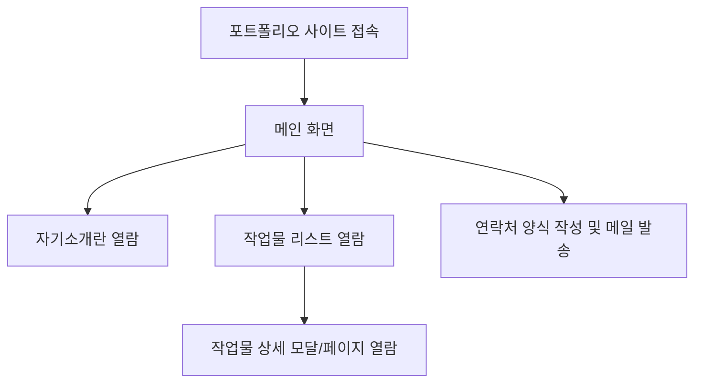
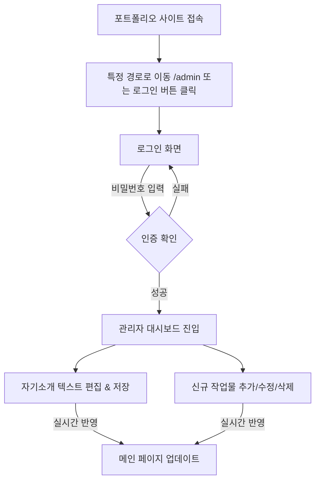

# 제품 요구사항 정의서 (PRD) 123

## 프로젝트명: 직코의 Arduino & 바이브코딩 포트폴리오 웹사이트

**작성일:** 2026년 7월 6일  
**기획자:** 포트폴리오 전문 기획자 (Antigravity)  
**대상 독자:** 초보 개발자(직코), 웹사이트 방문자(누구나)

---

## 1. 프로젝트 개요 (Overview)

### 1.1 목적 및 배경

본 프로젝트는 **'직코'**님의 개인 작업물을 체계적으로 기록하고 전시하여, 누구나 열람할 수 있는 웹 기반의 개인 포트폴리오 사이트를 구축하는 것입니다.  
단순한 정적 페이지를 넘어, **코드 수정 없이 웹 브라우저에서 직접 자기소개와 작업물을 관리할 수 있는 동적 기능**을 포함합니다.

### 1.2 타깃 사용자 (Target Audience)

- **일반 방문자 (누구나):** 직코의 포트폴리오에 관심을 가지고 방문하여 작업물을 열람하고 연락을 취하고자 하는 사람.
- **관리자 (직코):** 소스 코드를 건드리지 않고, 비밀번호 로그인을 통해 웹사이트상에서 실시간으로 프로필 정보와 프로젝트(작업물)를 관리하고자 하는 사용자.

### 1.3 핵심 가치 및 목표

- **쉬운 관리:** 초보자도 쉽게 웹에서 데이터를 추가, 수정, 삭제할 수 있도록 구현합니다.
- **직관적인 디자인:** 아두이노와 바이브코딩이라는 창의적이고 테크니컬한 관심 분야를 돋보이게 하는 현대적인 UI를 제공합니다.
- **빠른 로딩 및 배포:** 순수 HTML, CSS, JavaScript를 기반으로 하여 서버 운영 비용 없이 빠르고 가볍게 배포합니다.

---

## 2. 시스템 아키텍처 및 기술 스택 (Architecture & Tech Stack)

초보자가 복잡한 서버(Node.js, Express 등)나 데이터베이스(MySQL 등)를 직접 구축하지 않고도 **동적 관리자 기능**을 구현할 수 있도록 **BaaS(Backend as a Service)** 서비스를 연동하는 구조를 제안합니다.

- **프론트엔드 (Frontend):**
  - **HTML5 / CSS3 / Vanilla JavaScript:** 라이브러리나 프레임워크 학습 부담 없이 브라우저 기본 기능만으로 구현하여 동작 속도가 빠르고 배포가 쉽습니다.
- **백엔드 및 데이터베이스 (BaaS):**
  - **Supabase (또는 Firebase):** 무료 제공량이 넉넉하며, HTML/JS 환경에서 SDK 링크 하나로 손쉽게 로그인 인증 및 실시간 데이터베이스(DB) 기능을 사용할 수 있습니다.
- **이메일 전송 API:**
  - **EmailJS:** 백엔드 메일 서버 없이 프론트엔드 JavaScript에서 사용자의 이메일 문의를 직코님의 메일함으로 바로 전송해주는 무료 API 서비스입니다.
- **호스팅 (Hosting):**
  - **GitHub Pages / Netlify / Vercel:** 소스코드가 담긴 깃허브 저장소를 연결하면 무료로 전송 및 배포해주는 정적 웹 호스팅 서비스입니다.

---

## 3. 사용자 플로우 (User Flow)

### 3.1 일반 방문자 플로우

### 3.2 관리자 (직코) 플로우

---

## 4. 기능 및 화면 설계 (Detailed Specifications)

### 4.1 메인 페이지 (Main Portfolio Page)

#### 4.1.1 헤더 및 내비게이션 (Header & Navigation)

- **로고 / 타이틀:** 왼쪽 상단에 '직코의 포트폴리오' 표시.
- **메뉴 링크:** [자기소개], [작업물], [연락처] 세 가지 섹션으로 부드럽게 스크롤 이동(Smooth Scroll)하는 링크 제공.
- **관리자 로그인 버튼:** 헤더 구석 또는 푸터 영역에 작게 배치하여 직코님이 관리 화면으로 이동할 수 있도록 함.

#### 4.1.2 자기소개 섹션 (About Me Section)

- **목적:** 직코님에 대한 소개글을 보여줍니다.
- **표시 항목:**
  - **이름:** '직코'
  - **관심 분야:** '아두이노(Arduino)', '바이브코딩(Vibe Coding)'을 직관적인 아이콘이나 태그 형태로 시각화.
  - **할 수 있는 것:** 다룰 수 있는 하드웨어/소프트웨어 기술 리스트 (예: C/C++ 코딩, 회로 설계, 프롬프트 엔지니어링 등).
- **특징:** 관리자가 수정한 소개 문구가 실시간(DB 데이터 반영)으로 갱신되어 출력됩니다.

#### 4.1.3 작업물(프로젝트) 섹션 (Works Section)

- **목적:** 제작한 프로젝트 카드를 그리드(Grid) 레이아웃 형태로 배치하여 한눈에 볼 수 있도록 합니다.
- **카드 구성 요소:**
  1.  **대표 이미지:** 아두이노 회로 작동 모습이나 바이브코딩 캡처 화면.
  2.  **프로젝트 제목:** 예) "아두이노 스마트 화분"
  3.  **한 줄 소개:** 예) "토양 수분 센서를 활용한 자동 급수 화분 제작"
  4.  **사용 기술 태그:** `#Arduino` `#C++` `#VibeCoding` 등
- **상세 보기 모달 (Popup Detail Window):**
  - 카드를 클릭하면 레이어 팝업 형태로 상세 내용이 나타납니다.
  - **상세 설명:** 프로젝트 기획 목적, 부품 구성, 제작 과정, 겪었던 문제와 해결 방법 등의 긴 텍스트.
  - **미디어 영역:** 관련 추가 이미지 슬라이드 또는 데모 유튜브 영상 임베드.
  - **링크 버튼:** GitHub 저장소 이동 버튼, 프로젝트 구동 데모 링크 등.

#### 4.1.4 연락처 섹션 (Contact Form Section)

- **목적:** 방문자가 직코님에게 이메일로 협업 및 문의 메시지를 보낼 수 있는 폼(Form)을 제공합니다.
- **입력 양식:**
  - 보내는 사람 이름 (텍스트)
  - 보내는 사람 이메일 주소 (이메일 포맷 유효성 검사 필수)
  - 메시지 제목 (텍스트)
  - 메시지 내용 (텍스트 영역, textarea)
- **동작:**
  - '보내기' 버튼 클릭 시, JavaScript 내에서 **EmailJS API**를 호출하여 설정된 직코님의 이메일 주소로 전송.
  - 전송 완료 시 "성공적으로 메시지가 발송되었습니다" 알림(Toast) 표시.

---

### 4.2 관리자 페이지 (Admin Page - `/admin.html`)

#### 4.2.1 로그인 화면 (Login Interface)

- **기능:** 비밀번호만 간단히 입력하여 로그인(인증)할 수 있는 보안 화면.
- **구현:** Supabase의 Auth 기능을 활용해 이메일/비밀번호로 로그인하거나, DB에 저장된 관리자 토큰 값을 비교하는 방식으로 인증 처리.

#### 4.2.2 관리자 대시보드 화면 (Dashboard)

로그인에 성공한 관리자(직코)에게만 노출되는 페이지입니다.

- **자기소개 관리 폼:**
  - 기존 등록된 이름, 관심 분야, 소개글 텍스트가 입력 칸에 로드됩니다.
  - 내용 수정 후 '저장' 버튼을 누르면 Supabase DB의 'about_me' 테이블 데이터가 업데이트됩니다.
- **작업물(프로젝트) 관리 테이블:**
  - **추가 버튼:** 새 프로젝트의 제목, 한 줄 소개, 사용 기술, 상세 본문(마크다운 형식 지원 권장), 이미지 주소, 동영상 링크, 외부 링크를 입력하고 등록하는 모달 폼을 엽니다.
  - **수정 버튼:** 기존 프로젝트 카드의 정보를 불러와 수정하고 DB에 저장합니다.
  - **삭제 버튼:** 잘못 올린 작업물을 삭제하여 메인 페이지에서 즉시 내릴 수 있도록 합니다.

---

## 5. 데이터 구조 정의 (Data Schema)

Supabase(데이터베이스)에 생성할 테이블 구조 예시입니다. 초보자도 쉽게 따라 할 수 있도록 단순화했습니다.

### 5.1 `profile` 테이블 (자기소개용)

| 컬럼명      | 데이터 타입           | 설명               | 예시                                  |
| :---------- | :-------------------- | :----------------- | :------------------------------------ |
| `id`        | Integer (Primary Key) | 데이터 구분 번호   | `1`                                   |
| `name`      | String                | 이름               | `"직코"`                              |
| `interests` | Array of String       | 관심 분야          | `["아두이노", "바이브코딩"]`          |
| `skills`    | Array of String       | 할 수 있는 것      | `["회로 설계", "C/C++", "웹 프론트"]` |
| `bio`       | Text                  | 상세 자기소개 문구 | `"창의적인 메이커 직코입니다..."`     |

### 5.2 `projects` 테이블 (작업물 목록용)

| 컬럼명        | 데이터 타입         | 설명                    | 예시                                 |
| :------------ | :------------------ | :---------------------- | :----------------------------------- |
| `id`          | UUID / Integer (PK) | 고유 번호               | `1`                                  |
| `title`       | String              | 프로젝트 제목           | `"스마트 화분 프로젝트"`             |
| `summary`     | String              | 한 줄 설명              | `"식물의 수분을 자동으로 측정..."`   |
| `tags`        | Array of String     | 사용 기술 태그          | `["Arduino", "C++", "IoT"]`          |
| `description` | Text                | 상세 제작기 및 설명     | `"1. 기획 단계 \n2. 회로도 작성..."` |
| `image_url`   | String              | 대표 이미지 파일 링크   | `"https://.../pot.jpg"`              |
| `video_url`   | String              | 유튜브 데모 링크 (선택) | `"https://youtube.com/..."`          |
| `link_github` | String              | 깃허브 소스코드 주소    | `"https://github.com/..."`           |
| `created_at`  | Timestamp           | 등록일                  | `2026-07-06 13:56:00`                |

---

## 6. 비기능적 요구사항 (Non-functional Requirements)

1.  **반응형 웹 디자인 (Responsive Design):**
    - 스마트폰, 태블릿, PC 등 어떤 디바이스로 접속해도 어색하지 않게 화면 레이아웃이 유동적으로 변화해야 합니다. (CSS Media Query 사용)
2.  **보안 및 인증 (Security):**
    - Supabase RLS(Row Level Security) 규칙을 적용하여, **일반 방문자는 데이터를 오직 '읽기(Select)'만** 할 수 있어야 하며, **직코(인증된 계정)만 '쓰기/수정/삭제'**를 할 수 있도록 권한을 통제합니다.
3.  **성공적인 로딩 속도:**
    - 아두이노 프로젝트 등의 고용량 이미지는 용량을 압축(WebP 포맷 등 사용 권장)하여 업로드하도록 유도합니다.

---

## 7. 단계별 구현 마일스톤 (Milestones)

초보자 관점에서 하나씩 차근차근 완성하기 위한 가이드라인입니다.

1.  **[1단계] 화면 레이아웃 마크업 (정적 사이트 개발):**
    - HTML과 CSS만 사용하여 포트폴리오의 외관(레이아웃)을 완벽히 잡습니다. 이때 데이터는 임시로 정적 코드로 박아둡니다.
2.  **[2단계] Supabase 백엔드 연동:**
    - Supabase 프로젝트를 생성하고 `profile`, `projects` 테이블을 생성합니다.
    - JavaScript SDK를 HTML에 연결하고, 메인 화면 로드 시 DB에서 데이터를 실시간으로 가져와 화면에 그리는(Rendering) 스크립트를 작성합니다.
3.  **[3단계] 관리자 로그인 및 대시보드 연동:**
    - `/admin.html` 페이지를 만들고 관리자 인증 절차를 테스트합니다.
    - 어드민 화면에서 작성한 데이터가 DB에 반영되고, 메인 페이지가 동적으로 변하는지 검증합니다.
4.  **[4단계] 이메일 및 편의 기능 추가:**
    - EmailJS 연동 작업을 거쳐 Contact Form을 동작시킵니다.
    - 전체적인 레이아웃의 디테일과 반응형 웹 요소(CSS)를 다듬습니다.
5.  **[5단계] 최종 배포:**
    - GitHub 저장소에 올리고 GitHub Pages를 통해 전 세계에 무료 배포합니다.
